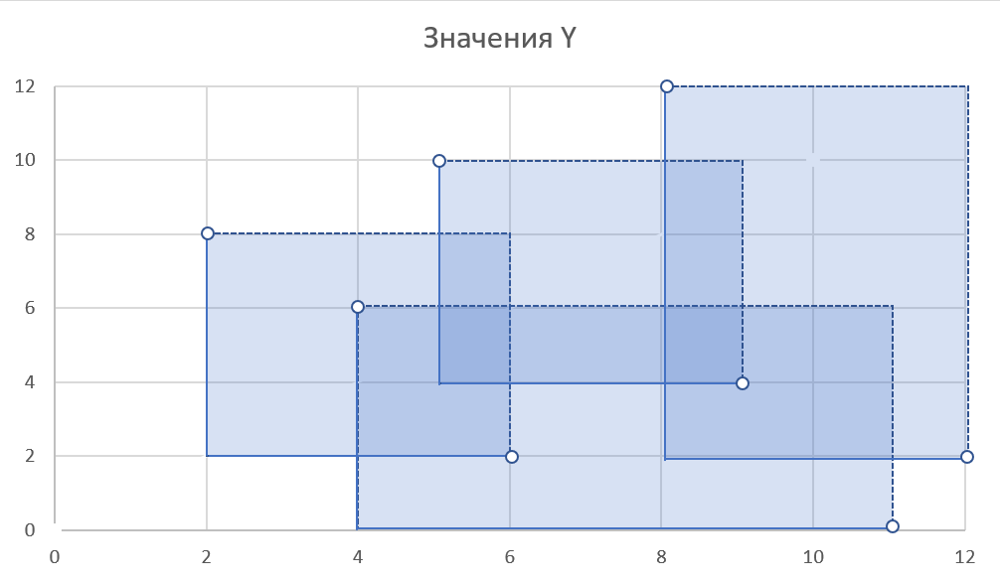
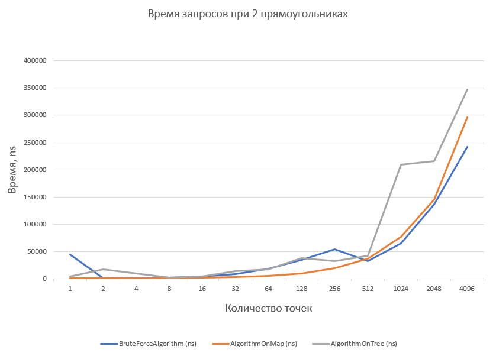
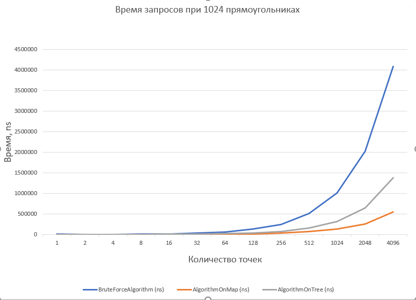
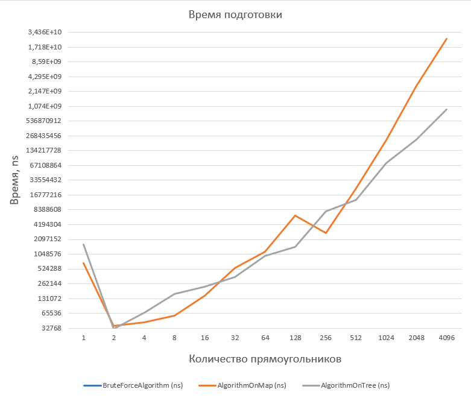
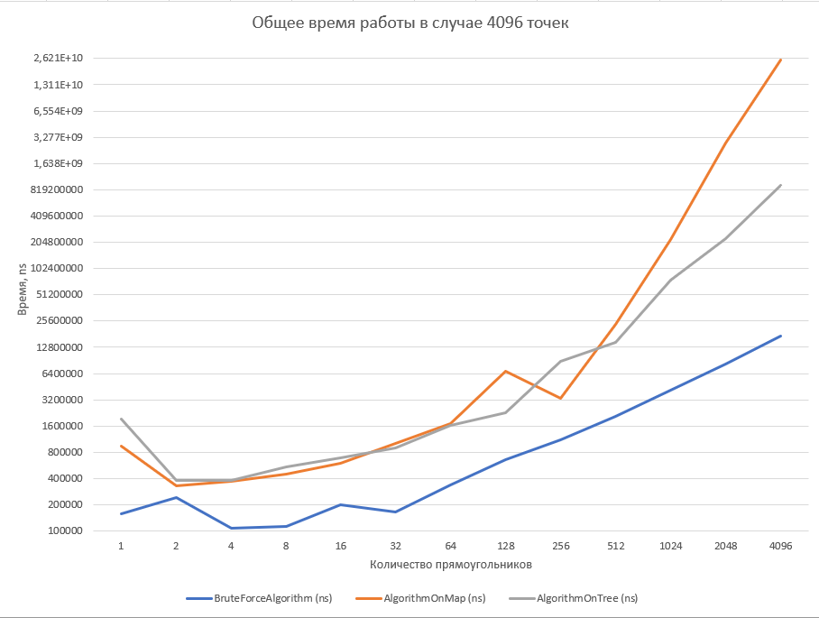

# Лабораторная работа 2

## Задача

Даны прямоугольники на плоскости с углами в целочисленных координатах ([1..10^9], [1..10^9]). Требуется как можно быстрее выдавать ответ на вопрос «Скольким прямоугольникам принадлежит точка (x, y)?» И подготовка данных должна занимать мало времени.

UPD: только нижние границы включены => (x1 <= x) && (x < x2) && (y1 <= y) && (y < y2)

## Пример

### Прямоугольники
- {(2,2),(6,8)}
- {(5,4),(9,10)}
- {(4,0),(11,6)}
- {(8,2),(12,12)}

### Точка-ответ
- (2,2) -> 1
- (12,12) -> 0
- (10,4) -> 2
- (5,5) -> 3
- (2,10) -> 0
- (2,8) -> 0



## Реализация

### Алгоритм перебора

#### Описание
Этот алгоритм заключается в простом переборе всех прямоугольников для каждой точки, которая ищется. При каждом запросе точки алгоритм просматривает все прямоугольники и подсчитывает количество прямоугольников, содержащих точку.

#### Эффективность
- Подготовка: O(1) (так как нет предварительной подготовки)
- Поиск: O(N) (где N - количество прямоугольников)

#### Реализация:
- Простой перебор.
```java
static public int[] query(Rectangle[] rectangles, Point[] points) {
    int[] result = new int[points.length];
    for (int i = 0; i < points.length; ++i) {
        int counter = 0;
        for (Rectangle rectangle : rectangles) {
            if (isPointInsideRectangle(points[i], rectangle)) {
                ++counter;
            }
        }
        result[i] = counter;
    }
    return result;
}
```


### Алгоритм на карте

#### Описание
Этот алгоритм включает в себя сжатие координат для уменьшения объема данных и построение карты, подсчётом для каждой клетки количества прямоугольников, которые её покрывают. Для каждой точки с помощью бинарного поиска находится соответсвующий её координатам квадрант и выводится количество прямоугольников, его покрывающее.

#### Эффективность
- Подготовка: O(N^3) (где N - количество прямоугольников)
- Поиск: O(logN) (так как используется бинарный поиск)

#### Реализация:
- Для начала нужно создать структуры данных, в которых будут храниться горизонтальные и вертикальные координаты прямоугольников в отсортированном порядке без дубликатов:
```java
public void createMapCoord(Rectangle[] rectangles) {
    TreeSet<Double> comprX = new TreeSet<>();
    TreeSet<Double> comprY = new TreeSet<>();
    for (Rectangle rect : rectangles) {
        comprX.add(rect.getFirst_coordinate().getX());
        comprX.add(rect.getSecond_coordinate().getX());
        comprY.add(rect.getFirst_coordinate().getY());
        comprY.add(rect.getSecond_coordinate().getY());
    }
    this.compressedX = comprX.toArray(new Double[comprX.size()]);
    this.compressedY = comprY.toArray(new Double[comprY.size()]);
    this.map = null;
}
```
- После создать и заполнить матрицу, соответствующую этим координатам. Заполнение проходит путём перебора всех прямоугольников, и во всех клетка, которые покрывает соответствующий прямоугольник значение увеличивается на 1:
```java
public void fillMap(Rectangle[] rectangles) {
    this.map = new int[compressedX.length][compressedY.length];
    for (Rectangle rect : rectangles) {
        int X1 = binarySearch(this.compressedX, rect.getFirst_coordinate().getX());
        int X2 = binarySearch(this.compressedX, rect.getSecond_coordinate().getX());
        int Y1 = binarySearch(this.compressedY, rect.getFirst_coordinate().getY());
        int Y2 = binarySearch(this.compressedY, rect.getSecond_coordinate().getY());


        for (int i = X1; i < X2; ++i) {
            for (int j = Y1; j < Y2; ++j) {
                ++this.map[i][j];
            }
        }
    }
}
```
- Теперь перебираются все точки, для каждой бинарным поиском находятся нужные индексы и в соответствии этим индексам ответ.
```java
static public int[] query(Point[] points, CompressedCoordinateMap map) {
    int[] result = new int[points.length];
    for (int i = 0; i < points.length; ++i) {
        int X = CompressedCoordinateMap.binarySearch(map.getCompressedX(), points[i].getX());
        int Y = CompressedCoordinateMap.binarySearch(map.getCompressedY(), points[i].getY());
        if (X == -1 || Y == -1) {
            result[i] = 0;
        } else {
            result[i] = map.getMap()[X][Y];
        }
    }
    return result;
}
```

### Алгоритм на дереве

#### Описание
Этот алгоритм включает в себя сжатие координат для уменьшения объема данных и построение персистентного дерева отрезков. Каждый узел дерева отвечает за определенный участок плоскости, на котором хранится информация о прямоугольниках в этом участке. Поиск выполняется путем получение нужного корня в персистентном дерева, а после обходя этого дерева для нахождения нужного значения.

#### Эффективность
- Подготовка: O(NlogN) (где N - количество прямоугольников)
- Поиск: O(logN) (так как используется персистентное дерево отрезков)

#### Реализация:
- Для начала произведём сжатие координат, как и в предыдущем пункте.
- После построим персистентное дерево на массиве нулей длинной сжатого массива вертикальных координат.
```java
public Node build(double[] arr, int l, int r) {
    if (l > r) return null;
    if (l == r) {
        return new Node(l, r, arr[l], null, null);
    }
    int m = (l + r) / 2;
    Node left = build(arr, l, m);
    Node right = build(arr, m + 1, r);
    return new Node(l, r, Math.max(left.getValue(), right.getValue()), left, right);
}
```
- Добавим функцию обновления дерева, которая принимает на вход диапазон индексов, значение, которое нужно прибавить, и корень, а возвращает корень следующей версии дерева.
```java
public Node update(int l, int r, int x, Node node) {
    if (node.getStart() > r || node.getEnd() < l) return node;
    if (node.getLeft() == null || node.getRight() == null) {
    Node node_new = new Node(node);
    node_new.setValue(node_new.getValue() + x);
    return node_new;
    }
    if (node.getStart() >= l & node.getEnd() <= r) {
    Node node_new = new Node(node);
    node_new.setLeft(update(l, r, x, node.getLeft()));
    node_new.setRight(update(l, r, x, node.getRight()));
    node_new.setValue(Math.max(node.getLeft().getValue(), node.getRight().getValue()));
    return node_new;
    }
    Node node_new = new Node(node);
    node_new.setLeft(update(l, r, x, node.getLeft()));
    node_new.setRight(update(l, r, x, node.getRight()));
    node_new.setValue(Math.max(node_new.getLeft().getValue(), node_new.getRight().getValue()));
return node_new;
}
```
- После создадим массив структур, которые будут хранить все горизонтальные координаты прямоугольников и в соответствии им границы вертикальных координат и флаг того начался тут прямоугольник или нет.
```java
RectangleBoundary[] boundary = new RectangleBoundary[2 * rectangles.length];
for (int i = 0; i < rectangles.length; ++i) {
    int startY = CompressedCoordinateMap.binarySearch(map.getCompressedY(), rectangles[i].getFirst_coordinate().getY());
    int endY = CompressedCoordinateMap.binarySearch(map.getCompressedY(), rectangles[i].getSecond_coordinate().getY());
    int X1 = CompressedCoordinateMap.binarySearch(map.getCompressedX(), rectangles[i].getFirst_coordinate().getX());
    int X2 = CompressedCoordinateMap.binarySearch(map.getCompressedX(), rectangles[i].getSecond_coordinate().getX());
    
    boundary[2 * i] = new RectangleBoundary(startY, endY - 1, X1, 1);
    boundary[2 * i + 1] = new RectangleBoundary(startY, endY - 1, X2, -1);
}
Arrays.sort(boundary, (rect1, rect2) -> Integer.compare(rect1.getX(), rect2.getX()));
```
- Теперь переберём этот массив и будем обновлять наше дерево для каждой следующей горизонтальной координаты и сохранять корень на новую версию дерева. Данные подготовлены. Если встречаем новый прямоугольник - значение в диапазоне дерева увеличиваются на 1, если прямоугольник заканчивается - уменьшаются.
```java
int X = -2000000000;
for (RectangleBoundary boun : boundary) {
    if (boun.getX() != X) {
        tree.getVersions().add(tree.update(boun.getStartY(), boun.getEndY(), boun.getCondition(), tree.getVersions().get(tree.getVersion())));
        tree.setVersion(tree.getVersion() + 1);
        X = boun.getX();
    } else {
        tree.getVersions().set(tree.getVersion(), tree.update(boun.getStartY(), boun.getEndY(), boun.getCondition(), tree.getVersions().get(tree.getVersion())));
    }
}
```
- Теперь можно перебрать все точки и получить ответ.
```java
static public double[] query(Point[] points, CompressedCoordinateMap map, PersistentSegmentTree tree) {
  double[] result = new double[points.length];
  for (int i = 0; i < points.length; ++i) {
    int X_p = CompressedCoordinateMap.binarySearch(map.getCompressedX(), points[i].getX());
    int Y_p = CompressedCoordinateMap.binarySearch(map.getCompressedY(), points[i].getY());
    if (X_p == -1 || Y_p == -1) {
      result[i] = 0;
    } else {
      result[i] = tree.queryAtIndex(X_p + 1, Y_p);
    }
  }
  return result;
}
```
## Тестирование и выводы

### Правила тестирования

Тестирование проводилось в соответствии со следующими правилами:

- Для тестового набора прямоугольников использовался набор вложенных друг-в-друга с координатами с шагом больше 1, {(10\*i, 10\*i), (10*(2N-i), 10*(2N-i))}, где N - количество прямоугольников.
- Для тестового набора точек использовался неслучайный набор, распределенный более-менее равномерно по ненулевому пересечению прямоугольников. Для этого использовалась хэш-функция от i с разным базисом для x и y: (p\*i)^31%(20\*N), где p - большое простое число, разное для x и y.
- Количество прямоугольников - 2^n, 0<=n<=12
- Количество точек - 2^m, 0<=m<=12

### Результаты тестирования
#### Анализ времени запросов
 
 
 

В целом, при небольшом объеме данных все алгоритмы проявляют высокую производительность, но при росте объема важным фактором становится количество прямоугольников.
Из графиков видно, что при небольшом количестве прямоугольников (до 100) алгоритм полного перебора демонстрирует наилучшую производительность. Это связано с тем, что несмотря на более низкую асимптотическую сложность, константы в других алгоритмах оказываются выше, что замедляет их работу и позволяет алгоритму полного перебора эффективнее справляться с малыми объемами данных.
Однако при небольшом увеличении числа прямоугольников алгоритм полного перебора становится невыгодным из-за своей неэффективности, в то время как алгоритмы на дереве и карте показывают сопоставимую производительность, хотя алгоритм на дереве немного отстает из-за своих констант.
#### Анализ времени подготовки данных

Из графика видно, что при небольшом числе прямоугольников как алгоритм на карте, так и алгоритм на дереве демонстрируют примерно одинаковое время подготовки данных. Однако, начиная с определенного момента, примерно при 512 прямоугольниках, алгоритм на карте значительно увеличивает время подготовки данных и сильно уступает алгоритму на дереве в скорости.
#### Общее время

Рассмотрим случай с 4096 точками.
Можно сделать вывод, что алгоритм перебора проявил себя лучше всего в общем времени подготовки данных и ответов на запросы. Это связано с тем, что в данном алгоритме отсутствует этап предварительной подготовки данных, что позволяет ему мгновенно отвечать на запросы. В отличие от этого, алгоритм на карте продемонстрировал худший результат из-за длительности процесса подготовки данных, превышающей время подготовки в других алгоритмах.
Результаты тестирования показали, что эффективность каждого алгоритма зависит от размера входных данных. При небольшом количестве прямоугольников и точек алгоритм перебора оказывается более эффективным, так как его сложность времени выполнения O(N). Однако при увеличении размера входных данных алгоритм на дереве начинает показывать лучшую производительность благодаря своей сложности времени выполнения O(logN). Алгоритм на карте также продемонстрировал хорошую производительность, особенно при больших объемах данных, но его время подготовки данных оказалось значительно выше.

### Выводы

- Зависимость производительности алгоритмов от размера входных данных: при увеличении количества прямоугольников и точек временная эффективность алгоритмов на дереве и на карте становится более заметной, а алгоритм перебора уступает.
- Алгоритм полного перебора обладает преимуществом при небольших объемах данных благодаря его линейной сложности времени выполнения.
- С ростом размера данных алгоритм на дереве проявляет лучшую производительность из-за его логарифмической сложности времени выполнения.
- Алгоритм на карте также эффективен, особенно при больших объемах данных, однако он подготавливает данные сильно дольше, из-за чего часто может быть менее предпочтителен, чем алгоритм на дереве.
